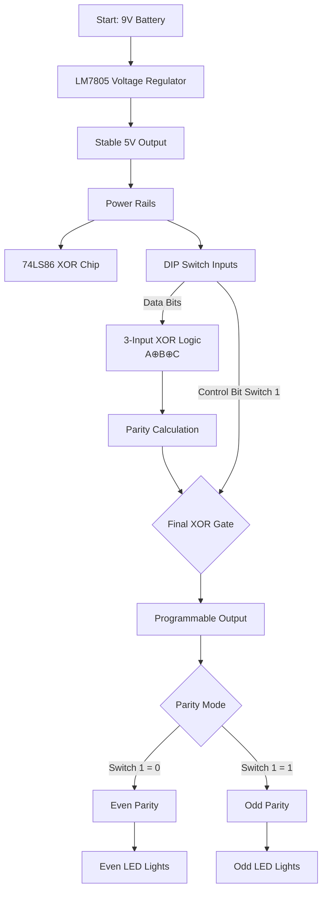

# 3-Bit Programmable Parity Generator - Complete Build & Viva Guide



## Table of Contents
- [Project Overview](#project-overview)
- [Quick Build Checklist](#quick-build-checklist)
- [Phase 1: Component Placement](#phase-1-component-placement)
- [Phase 2: Powering the Board](#phase-2-powering-the-board)
- [Phase 3: The Inputs (Switches)](#phase-3-the-inputs-switches)
- [Phase 4: The Logic (The Brain)](#phase-4-the-logic-the-brain)
- [Phase 5: The Outputs (LEDs)](#phase-5-the-outputs-leds)
- [Viva Questions & Answers](#viva-questions--answers)
- [Troubleshooting Scenarios](#troubleshooting-scenarios)
- [Theory & Applications](#theory--applications)

## Project Overview
**"Sir/Ma'am, this is a Programmable Parity Generator for error detection in digital communications."**

In digital systems (USB, WiFi, RAM), noise can flip bits during transmission. This circuit:
- Generates a **parity bit** for 3-bit data
- Detects **single-bit errors** at the receiver
- Features **programmable mode**: Even or Odd parity via Switch 1
- Demonstrates **fundamental error detection** scalable to 8/16-bit systems

## Quick Build Checklist

| Phase | Task | Status | Pin Reference |
|-------|------|--------|---------------|
| 1 | Place 74LS86 (Notch at Row 10) | [ ] | - |
| 1 | Place DIP Switch (Rows 22-25) | [ ] | - |
| 1 | Place LM7805 (A1,A2,A3) | [ ] | Silver back away |
| 2 | Connect Battery: Red→B1, Black→Blue(-) | [ ] | - |
| 2 | Regulator GND: B2→Blue(-) | [ ] | - |
| 2 | Regulator OUT: B3→Red(+) | [ ] | - |
| 2 | Chip Power: J10→Red(+) | [ ] | - |
| 2 | Chip Ground: A16→Blue(-) | [ ] | - |
| 3 | Switch Power: H23,H24,H25→Red(+) | [ ] | - |
| 3 | Pull-down Resistors: B23,B24,B25→Blue(-) | [ ] | - |
| 4 | Input A: D23→D10 | [ ] | - |
| 4 | Input B: D24→D11 | [ ] | - |
| 4 | **CRITICAL BRIDGE**: C12→C13 | [ ] | Most important! |
| 4 | Input C: D25→D14 | [ ] | - |
| 4 | Inverter Feed: D15→G15 | [ ] | - |
| 4 | Inverter Power: G14→Red(+) | [ ] | - |
| 5 | Even Resistor: A15→A7 | [ ] | - |
| 5 | Even LED: Long→B7, Short→Blue(-) | [ ] | - |
| 5 | Odd Resistor: J16→J6 | [ ] | - |
| 5 | Odd LED: Long→I6, Short→Blue(-) | [ ] | - |

---

## Phase 1: Component Placement

### 74LS86 XOR IC
```
    Front View
    ┌──┐
    │  │← Notch (Row 10)
14 │  │ 1
13 │  │ 2
12 │  │ 3
11 │  │ 4
10 │  │ 5
 9 │  │ 6
 8 │  │ 7
    └──┘
Pin 14: Vcc (+5V) → J10
Pin 7: GND → A16
```

### LM7805 Voltage Regulator
```
    Silver Back (Heatsink)
    ┌─────────┐
IN │o        o│ OUT
   │         │
GND│o        │
   └─────────┘
Legs: A1(IN), A2(GND), A3(OUT)
Orientation: Silver back FACING AWAY from board center
```

### DIP Switch Configuration
```
Rows 22-25 (4 switches total)
Switch 1: Row 22 (Control Bit)
Switch 2: Row 23 (Data Bit A)
Switch 3: Row 24 (Data Bit B)
Switch 4: Row 25 (Data Bit C)
```

---

## Phase 2: Powering the Board

### Power Flow Diagram
```
9V Battery → LM7805 → 5V Rails → Components
      ↑           ↓           ↓
    Raw DC    Regulated    Clean 5V
    Power        5V        to Logic
```

### Critical Voltage Protection
| Component | Max Voltage | Why Protection Needed |
|-----------|------------|----------------------|
| 74LS86 IC | 5.25V | CMOS transistors fry at ~7V |
| LED | 3.3V | Exceeds forward voltage causes burnout |
| Logic Inputs | 5.5V | Latch-up destroys internal junctions |

**LM7805 Operation**: Drops 9V→5V, dissipating 4V×current as heat. Without it, 9V would instantly destroy the 74LS86.

---

## Phase 3: The Inputs (Switches)

### Pull-Down Resistor Theory
```
When Switch OPEN:
Input → Resistor → GND = Stable 0V (LOW)

When Switch CLOSED:
5V → Input = 5V (HIGH)
      ↓
    Resistor to GND
    (Current flows, but voltage at pin is HIGH)
```

**Why 10kΩ resistors?**
- Low enough to overcome leakage currents
- High enough to limit current when switch closed: I = V/R = 5V/10kΩ = 0.5mA
- Prevents "floating inputs" that act as antennas for noise

---

## Phase 4: The Logic (The Brain)

### XOR Gate Truth Table
| A | B | A⊕B | Parity |
|---|---|-----|---------|
| 0 | 0 | 0 | Even |
| 0 | 1 | 1 | Odd |
| 1 | 0 | 1 | Odd |
| 1 | 1 | 0 | Even |

### 3-Bit Parity Calculation
```
Stage 1: (A ⊕ B) at Gate 1 (Pins 1,2,3)
Stage 2: (A⊕B) ⊕ C at Gate 2 (Pins 4,5,6)
Stage 3: Final XOR with Control Bit at Gate 3 (Pins 12,13,11)
```

### Critical Bridge Wire (C12→C13)
```
Without Bridge:        With Bridge:
Gate1 Out → Nothing   Gate1 Out → Gate2 In
Gate2 In → Floating   Complete logic chain!
Circuit DEAD          Circuit ALIVE
```

### Programmable Feature
```
Switch 1 = 0: Output = (A⊕B⊕C)        (Even Parity)
Switch 1 = 1: Output = ¬(A⊕B⊕C)       (Odd Parity)
                     ↑
               Inverted by final XOR
```

---

## Phase 5: The Outputs (LEDs)

### LED Current Limiting Math
```
Desired current: 10-15mA
Voltage across LED: ~2V (Red LED)
Voltage across resistor: 5V - 2V = 3V
Using 330Ω: I = V/R = 3V/330Ω = 9.1mA ✓
Using 220Ω: I = 3V/220Ω = 13.6mA ✓
```

### LED Polarity Check
```
Correct:           Incorrect:
Long leg → +5V    Short leg → +5V
Short leg → GND   Long leg → GND
    ↑                  ↑
  Lights up        Doesn't light
                  (or damages LED)
```

---

## Viva Questions & Answers

### Category 1: Component Selection
**Q1: Why use XOR gates instead of other logic gates?**
> **A:** XOR uniquely performs modulo-2 addition without carry. It toggles output when odd number of inputs are HIGH, making it perfect for parity checking. Other gates don't track "oddness" consistently.

**Q2: Why 74LS86 instead of 74LS00 (NAND) or 74LS08 (AND)?**
> **A:** While NAND/AND gates can be combined to make XOR (using 4-5 gates), 74LS86 provides 4 XOR gates in one package with optimized internal circuitry specifically for parity operations.

**Q3: Why 10kΩ for pull-downs instead of 1kΩ or 100kΩ?**
> **A:** 10kΩ balances two needs: low enough to sink leakage currents (ensuring solid LOW), but high enough to avoid excessive current draw when switch is closed. 1kΩ would waste 5mA per switch; 100kΩ might not overcome leakage.

### Category 2: Power System
**Q4: What happens if we remove LM7805 and connect battery directly?**
> **A:** The 74LS86 has a 5.25V absolute maximum rating. 9V exceeds the breakdown voltage of internal PN junctions, causing:
> 1. Immediate overheating
> 2. Latch-up (parasitic transistor activation)
> 3. Permanent silicon crystal damage
> Result: IC becomes permanently non-functional within seconds.

**Q5: Why does LM7805 get warm/hot?**
> **A:** It dissipates power as heat: P = (Vin - Vout) × I = (9V-5V) × ~50mA = 0.2W. This is normal. Add heatsink if exceeding 0.5W.

**Q6: Can we use 4 AA batteries (6V) instead of 9V with regulator?**
> **A:** Yes, but LM7805 requires ~2V dropout. 6V input gives only 1V headroom. Better: use 5V USB power directly or LDO regulator with 0.5V dropout.

### Category 3: Logic Design
**Q7: How does Switch 1 make it "programmable"?**
> **A:** The final XOR gate acts as a controlled inverter:
> - Control=0: Output = Input (transparent)
> - Control=1: Output = NOT Input (inverting)
> This lets user select Even/Odd parity without rewiring.

**Q8: What's the purpose of the bridge wire C12→C13?**
> **A:** It cascades two XOR operations: First computes (A⊕B), second computes (A⊕B)⊕C. Without it, the second gate gets no input, breaking the 3-bit parity calculation.

**Q9: Can this detect 2-bit errors?**
> **A:** No. Parity checks detect ODD number of bit flips. 2-bit errors (even) go undetected. This is why advanced systems use CRC or Hamming codes.

### Category 4: Applications
**Q10: Where is parity used in real systems?**
> **A:** 
> - **RAM**: ECC memory (Error Correcting Code)
> - **Serial comms**: UART (start, data, parity, stop bits)
> - **RAID 5**: Distributed parity across disks
> - **QR Codes**: Error correction up to 30% damage

**Q11: How to extend to 8-bit parity?**
> **A:** Cascade more XOR gates: 
> ```
> Parity = (((((((A⊕B)⊕C)⊕D)⊕E)⊕F)⊕G)⊕H)
> ```
> Or use 74LS280 9-bit parity generator IC.

**Q12: What's beyond simple parity?**
> **A:** 
> 1. **Hamming Codes**: Detect AND correct single errors
> 2. **CRC**: Detect burst errors in networks
> 3. **Reed-Solomon**: Correct multiple errors (CDs, DVDs)
> 4. **LDPC**: Modern error correction (5G, WiFi 6)

---

## Troubleshooting Scenarios

### Scenario 1: "LED flickers randomly"
**Possible causes:**
1. **Loose breadboard connections** → Press all wires firmly
2. **Battery voltage <7V** → LM7805 needs minimum 7V input
3. **Missing pull-down resistors** → Floating inputs pick up noise
4. **Shared ground issue** → Ensure all grounds connect to same blue rail

**Diagnostic steps:**
```
1. Check battery with multimeter: Should be >8V fresh
2. Check 7805 output: Should be 4.75-5.25V steady
3. Check switch inputs with LED tester: Should be solid HIGH/LOW
4. Verify C12→C13 bridge is present and secure
```

### Scenario 2: "Only one LED works"
**Problem:** Even/Odd LED mismatch

**Solution matrix:**
| Symptom | Likely Cause | Fix |
|---------|-------------|-----|
| Even LED on, Odd off always | Odd LED backwards or dead | Check polarity, replace LED |
| Odd LED on, Even off always | Even resistor missing | Add 330Ω from A15 to A7 |
| Both LEDs same state | Final XOR gate wrong input | Check D22→G14 connection |
| Neither LED lights | Power to LEDs missing | Check Red rail connection to resistors |

### Scenario 3: "Circuit works but gets hot"
**Thermal analysis:**
```
Component    Normal Temp   Overheating Cause
LM7805       Warm to touch  >60°C = Excessive current draw
74LS86       Slightly warm  >40°C = Short circuit or wrong Vcc
LED          Cool           Hot = Missing current-limiting resistor
Resistor     Cool           Hot = Wrong value (too low)
```

**Quick fixes:**
1. **7805 hot**: Check output short to ground, add heatsink
2. **Chip hot**: Verify Vcc=5V (not 9V), check for output shorts
3. **LED/resistor hot**: Measure resistance: should be 220-470Ω

### Scenario 4: "Examiner asks to modify circuit"

| Request | Modification | Result |
|---------|-------------|---------|
| Show both Even & Odd LEDs simultaneously | Add LED from G15 to GND via 330Ω | Displays pre-inversion state |
| Make permanently Odd Parity | Remove D22→G14, connect G14→Red(+) | Switch 1 disabled, always inverted |
| Make 4-bit parity generator | Add 4th switch, connect to pin 9, bridge pin 8→12 | Extended capability |
| Test error detection | Introduce "error" by toggling bits after calculation | Demonstrate practical use |
| Remove programmable feature | Connect G14→Blue(-) instead of switch | Fixed Even parity mode |

### Scenario 5: "Demonstrate transmission error"
**Classroom demonstration:**
```
Step 1: Set data bits (e.g., 1 0 1)
Step 2: Note parity output (e.g., Even)
Step 3: "Transmit" data + parity bit
Step 4: Flip one data bit at receiver (simulate noise)
Step 5: Recalculate parity → Mismatch!
Step 6: Conclusion: ERROR DETECTED
```

---

## Theory & Applications

### Parity Mathematics
```
Even Parity: Total 1's (including parity bit) = Even number
Odd Parity: Total 1's (including parity bit) = Odd number

Example (Even parity):
Data: 1 0 1  (two 1's = even)
Parity bit: 0
Transmitted: 1 0 1 0 (still two 1's)

If received as 1 1 1 0 (three 1's = odd) → ERROR!
```

### Industry Applications Table
| Industry | Application | Parity Type | Purpose |
|----------|------------|-------------|---------|
| Computing | RAM ECC | Hamming Code (advanced parity) | Correct single-bit errors |
| Networking | Ethernet FCS | 32-bit CRC | Detect burst errors |
| Storage | RAID 5 | Distributed parity | Disk failure recovery |
| Wireless | Bluetooth | 1/3/5-bit parity | Error detection in packets |
| Space | Satellite comms | Reed-Solomon | Correct multiple errors |

### Scaling to Real Systems
```
This 3-bit demo → 8-bit system → 32-bit system
     ↓               ↓              ↓
Simple parity → Interleaved → 2D parity grid
                    parity

Advanced concept: Hamming(7,4) code:
- 4 data bits + 3 parity bits
- Can detect AND correct single-bit errors
- Parity bits calculated from overlapping subsets
```

---

## Final Viva Tips

### Presentation Script
> "Sir/Ma'am, I've built a **Programmable 3-Bit Parity Generator**. It demonstrates fundamental error detection used in digital communications. The LM7805 regulates 9V to 5V to protect the 74LS86 XOR gates. Three data bits enter, their parity is calculated, and Switch 1 selects Even or Odd output mode. This basic circuit scales to systems like RAM ECC or network error checking."

### Common Examiner Requests
1. **"Explain any one wire's purpose"** → Choose C12→C13 (critical bridge)
2. **"What happens if we remove X?"** → Explain system dependency
3. **"How would you improve this?"** → Suggest: Hamming codes, visual error display, transmission simulation
4. **"Show me an error case"** → Demonstrate bit flip causing parity mismatch

### Safety & Best Practices
1. **Always connect power LAST** to prevent shorts
2. **Double-check LM7805 orientation** (back faces outward)
3. **Verify LED polarity** before applying power
4. **Keep leads trimmed** to prevent accidental shorts
5. **Have spare 74LS86** in case of accidental overvoltage

---

## Quick Reference Cheat Sheet

### Truth Table Summary
| Switch 1 | A B C | Output | Parity | Odd LED | Even LED |
|----------|-------|--------|--------|---------|----------|
| 0 (Even) | 0 0 0 | 0 | Even | OFF | ON |
| 0 (Even) | 0 0 1 | 1 | Odd | ON | OFF |
| 0 (Even) | 0 1 0 | 1 | Odd | ON | OFF |
| ... | ... | ... | ... | ... | ... |
| 1 (Odd) | 0 0 0 | 1 | Odd | ON | OFF |
| 1 (Odd) | 0 0 1 | 0 | Even | OFF | ON |

### Voltage Measurements (Expected)
| Test Point | Voltage | Acceptable Range |
|------------|---------|------------------|
| LM7805 IN | 9V | 8.5-9.5V |
| LM7805 OUT | 5V | 4.75-5.25V |
| Red Rail | 5V | 4.75-5.25V |
| Switch HIGH | 5V | >4.5V |
| Switch LOW | 0V | <0.8V |
| LED anode | 5V/0V | Depends on logic |

### Common Faults & Fixes
| Problem | Likely Cause | Solution |
|---------|-------------|----------|
| No power anywhere | Battery dead/backwards | Replace/rotate battery |
| 7805 hot, no output | Output shorted | Check for wire touching ground |
| Chip gets hot | Vcc too high | Verify 5V, not 9V |
| LED dim | Resistor too high | Use 220-470Ω |
| Inputs unstable | Missing pull-downs | Add 10kΩ to GND |
| Bridge missing | C12→C13 not connected | ADD THIS WIRE! |

---

**Built successfully?** ✓ Check all boxes in the [Quick Build Checklist](#quick-build-checklist) above!

**Remember:** The bridge wire C12→C13 is the most commonly forgotten but most critical connection. Without it, the logic chain is broken!

**Good luck with your demonstration!**
